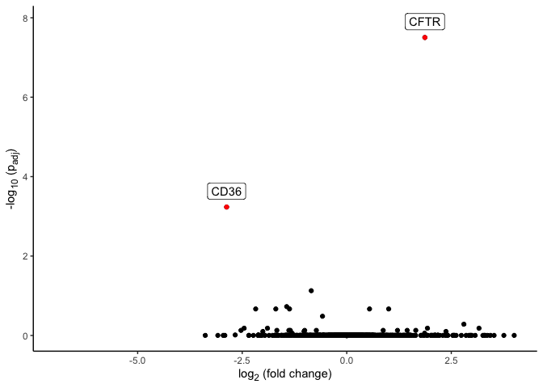

<!-- README.md is generated from README.Rmd. Please edit that file -->

# aggregateBioVar

<!-- badges: start -->

<!-- badges: end -->

Single cell RNA sequencing (scRNA-seq) studies allow gene expression
quantification at the level of individual cells. These studies introduce
multiple layers of biological complexity, including variations in gene
expression between cell states within a sample (*e.g.*, T cells versus
macrophages), between samples within a population (*e.g.*, biological or
technical replicates), and between populations (*e.g.*, healthy versus
diseased individuals). Many early scRNA-seq studies involved analysis of
gene expression within cells from a *single sample*. For single cell
RNA-seq data collected from more than one subject, `aggregateBioVar`
provides tools to summarize summarize single cell gene expression
profiles at the level of *samples* (*i.e.*, subjects) or *populations*.
Given an input
[`SingleCellExperiment`](https://bioconductor.org/packages/release/bioc/vignettes/SingleCellExperiment/inst/doc/intro.html)
object (Amezquita et al. [2020](#ref-SingleCellExperiment2020)) with
pre-defined cell states, `aggregateBioVar()` stratifies data as a list
of
[`SummarizedExperiment`](https://bioconductor.org/packages/release/bioc/vignettes/SummarizedExperiment/inst/doc/SummarizedExperiment.html)
objects (Morgan et al. [2020](#ref-R-SummarizedExperiment)). For each
cell type, gene counts are aggregated by subject into a
**gene-by-subject** count matrix, and column metadata are summarized to
retain *inter-subject* variation for downstream analysis with bulk
RNA-seq tools.

## Installation

<!-- # TODO Replace with BiocManager::install() -->

<!-- You can install the released version of aggregateBioVar from -->

<!-- [CRAN](https://CRAN.R-project.org) with: -->

<!-- ``` r -->

<!-- install.packages("aggregateBioVar") -->

<!-- ``` -->

Install the development version of `aggregateBioVar` from
[GitHub](https://github.com/) with:

``` r
# install.packages("devtools")
devtools::install_github("jasonratcliff/aggregateBioVar", build_vignettes=TRUE)
```

## Multi-subject scRNA-seq

``` r
library(aggregateBioVar)

# Bioconductor Packages
library(SummarizedExperiment, quietly = TRUE)
library(SingleCellExperiment, quietly = TRUE)
library(DESeq2, quietly = TRUE)

# Data analysis and visualization
library(dplyr, quietly = TRUE)
library(magrittr, quietly = TRUE)
library(ggplot2, quietly = TRUE)
library(ggtext, quietly = TRUE)
```

To illustrate the utility of *biological replication* for scRNA-seq
sequencing experiments, consider a `SingleCellExperiment` object with
scRNA-seq data from 7 subjects (SCF1, SCF2, SCF3, SWT1, SWT2, SWT3,
SWT4) in the context of a cystic fibrosis phenotype. Samples were
collected from small airway epithelium of newborn *Sus scrofa* with
genotypes from wild type (**CFTR+/+**, n=4) and *CFTR*-knockout
(**CFTR-/-**, n=3) individuals. Note the dimensions of this object, with
1339 genes from 2722 cells:

``` r
small_airway
#> class: SingleCellExperiment 
#> dim: 1339 2722 
#> metadata(0):
#> assays(1): counts
#> rownames(1339): MPC1 PRKN ... OTOP1 UNC80
#> rowData names(0):
#> colnames(2722): SWT1_AAAGAACAGACATAAC SWT1_AAAGGATTCTCCGAAA ...
#>   SCF3_TTTGGAGGTAAGGCTG SCF3_TTTGGTTCAATAGTAG
#> colData names(6): orig.ident nCount_RNA ... Region celltype
#> reducedDimNames(0):
#> altExpNames(0):
```

The primary function `aggregateBioVar()` takes a `SingleCellExperiment`
object with column metadata variables indicating subject identity
(*e.g.*, biological sample; `subjectVar`) and assigned cell type
(`cellVar`). The column metadata of a `SingleCellExperiment` object can
be obtained by `SummarizedExperiment::colData()`. Here, the metadata
variable `orig.ident` indicates the biological sample identifier and
`celltype` the inferred cell type.

``` r
# Perform aggregation of counts and metadata by subject and cell type.
aggregate_counts <-
    aggregateBioVar(
        scExp = small_airway,
        subjectVar = "orig.ident", cellVar = "celltype"
    )
#> Coercing metadata variable to character: celltype
```

Each element of the returned list contains a `SummarizedExperiment`
object with aggregated counts from cells in the assigned cell type
(indicated by `cellVar`).

``` r
aggregate_counts
#> $AllCells
#> class: SummarizedExperiment 
#> dim: 1339 7 
#> metadata(0):
#> assays(1): counts
#> rownames(1339): MPC1 PRKN ... OTOP1 UNC80
#> rowData names(0):
#> colnames(7): SWT1 SWT2 ... SWT4 SCF3
#> colData names(3): orig.ident Genotype Region
#> 
#> $`Immune cell`
#> class: SummarizedExperiment 
#> dim: 1339 7 
#> metadata(0):
#> assays(1): counts
#> rownames(1339): MPC1 PRKN ... OTOP1 UNC80
#> rowData names(0):
#> colnames(7): SWT1 SWT2 ... SWT4 SCF3
#> colData names(4): orig.ident Genotype Region celltype
#> 
#> $`Secretory cell`
#> class: SummarizedExperiment 
#> dim: 1339 7 
#> metadata(0):
#> assays(1): counts
#> rownames(1339): MPC1 PRKN ... OTOP1 UNC80
#> rowData names(0):
#> colnames(7): SWT1 SWT2 ... SWT4 SCF3
#> colData names(4): orig.ident Genotype Region celltype
#> 
#> $`Endothelial cell`
#> class: SummarizedExperiment 
#> dim: 1339 7 
#> metadata(0):
#> assays(1): counts
#> rownames(1339): MPC1 PRKN ... OTOP1 UNC80
#> rowData names(0):
#> colnames(7): SWT1 SWT2 ... SWT4 SCF3
#> colData names(4): orig.ident Genotype Region celltype
```

For each cell type subset, within-subject gene counts are aggregated and
column metadata are summarized to exclude variables with *intercellular*
variation. This effectively retains subject metadata and can be used for
downstream analysis with bulk RNA-seq tools. After aggregation, the
number of columns in the `SingleCellExperiment` object matches the
number of unique values in the subject metadata variable indicated by
`subjectVar`.

``` r
assay(aggregate_counts$`Immune cell`, "counts")
#> DataFrame with 1339 rows and 7 columns
#>              SWT1      SWT2      SWT3      SCF1      SCF2      SWT4      SCF3
#>         <numeric> <numeric> <numeric> <numeric> <numeric> <numeric> <numeric>
#> MPC1          257       209        56       315        33        93        42
#> PRKN            1         0         0         0         0         2         0
#> SLC22A3         0         0         0         1         0         0         0
#> CNKSR3          3         4         5         8         1         1         6
#> UTRN          166       155        32       233        27       116        20
#> ...           ...       ...       ...       ...       ...       ...       ...
#> CNNM1           0         0         0         0         0         0         0
#> GABRQ           0         0         0         0         0         0         0
#> GIF             0         0         0         0         0         0         0
#> OTOP1           0         0         0         0         0         0         0
#> UNC80           0         0         0         0         0         0         0
```

``` r
colData(aggregate_counts$`Immune cell`)
#> DataFrame with 7 rows and 4 columns
#>       orig.ident    Genotype      Region    celltype
#>      <character> <character> <character>    <factor>
#> SWT1        SWT1          WT       Small Immune cell
#> SWT2        SWT2          WT       Small Immune cell
#> SWT3        SWT3          WT       Small Immune cell
#> SCF1        SCF1      CFTRKO       Small Immune cell
#> SCF2        SCF2      CFTRKO       Small Immune cell
#> SWT4        SWT4          WT       Small Immune cell
#> SCF3        SCF3      CFTRKO       Small Immune cell
```

### Differential Gene Expression

The aggregate gene-by-subject matrix and subject metadata can be used as
inputs for bulk RNA-seq tools to investigate gene expression. Here, an
example is provided using
[`DESeq2`](https://bioconductor.org/packages/devel/bioc/vignettes/DESeq2/inst/doc/DESeq2.html)
(Love, Huber, and Anders [2014](#ref-DESeq2)). A `DESeqDataSet` can be
constructed from the aggregate gene-by-subject count matrix and
summarized column metadata.

``` r
subj_dds_dataset <-
    DESeqDataSetFromMatrix(
        countData = assay(aggregate_counts$`Secretory cell`, "counts"),
        colData = colData(aggregate_counts$`Secretory cell`),
        design = ~ Genotype
    )
#> converting counts to integer mode
#> Warning in DESeqDataSet(se, design = design, ignoreRank): some variables in
#> design formula are characters, converting to factors

subj_dds <- DESeq(subj_dds_dataset)
#> estimating size factors
#> estimating dispersions
#> gene-wise dispersion estimates
#> mean-dispersion relationship
#> final dispersion estimates
#> fitting model and testing

subj_dds_results <-
    results(subj_dds, contrast = c("Genotype", "WT", "CFTRKO"))
```

Add negative log<sub>10</sub> adjusted P-values, then plot against
log<sub>2</sub> fold change. Genes with adjusted P-values \< 0.05 and
fold-change absolute values \> 1.0 are highlighted in red and labeled by
feature.

``` r
subj_dds_transf <- as.data.frame(subj_dds_results) %>%
    bind_cols(feature = rownames(subj_dds_results)) %>%
    mutate(log_padj = - log(.data$padj, base = 10))

ggplot(data = subj_dds_transf) +
    geom_point(aes(x = log2FoldChange, y = log_padj), na.rm = TRUE) +
    geom_point(
        data = filter(
            .data = subj_dds_transf,
            abs(.data$log2FoldChange) > 1, .data$padj < 0.05
        ),
        aes(x = log2FoldChange, y = log_padj), color = "red"
    ) +
    geom_label(
        data = filter(
            .data = subj_dds_transf,
            abs(.data$log2FoldChange) > 1, .data$padj < 0.05
        ),
        aes(x = log2FoldChange, y = log_padj + 0.4, label = feature)
    ) +
    theme_classic() +
    labs(
        x = "log<sub>2</sub> (fold change)",
        y = "-log<sub>10</sub> (p<sub>adj</sub>)"
    ) +
    theme(
        axis.title.x = element_markdown(),
        axis.title.y = element_markdown())
```



## Vignettes

For a detailed workflow and description of package components, see the
package vignette:

``` r
vignette("multi-subject-scRNA-seq", package = "aggregateBioVar")
```

## References

<div id="refs">

<div id="ref-SingleCellExperiment2020">

Amezquita, Robert, Aaron Lun, Etienne Becht, Vince Carey, Lindsay Carpp,
Ludwig Geistlinger, Federico Marini, et al. 2020. “Orchestrating
Single-Cell Analysis with Bioconductor.” *Nature Methods* 17: 137–45.
<https://www.nature.com/articles/s41592-019-0654-x>.

</div>

<div id="ref-R-magrittr">

Bache, Stefan Milton, and Hadley Wickham. 2014. *magrittr: A
Forward-Pipe Operator for R*.
<https://CRAN.R-project.org/package=magrittr>.

</div>

<div id="ref-DESeq2">

Love, Michael I., Wolfgang Huber, and Simon Anders. 2014. “Moderated
Estimation of Fold Change and Dispersion for RNA-seq Data with DESeq2.”
*Genome Biology* 15 (12): 550.
<https://doi.org/10.1186/s13059-014-0550-8>.

</div>

<div id="ref-R-SummarizedExperiment">

Morgan, Martin, Valerie Obenchain, Jim Hester, and Hervé Pagès. 2020.
*SummarizedExperiment: SummarizedExperiment Container*.

</div>

<div id="ref-R-dplyr">

Wickham, Hadley, Romain François, Lionel Henry, and Kirill Müller. 2020.
*dplyr: A Grammar of Data Manipulation*.
<https://CRAN.R-project.org/package=dplyr>.

</div>

<div id="ref-R-cowplot">

Wilke, Claus O. 2019. *cowplot: Streamlined Plot Theme and Plot
Annotations for ’ggplot2’*.
<https://CRAN.R-project.org/package=cowplot>.

</div>

<div id="ref-R-ggtext">

———. 2020. *ggtext: Improved Text Rendering Support for ’ggplot2’*.
<https://CRAN.R-project.org/package=ggtext>.

</div>

</div>
